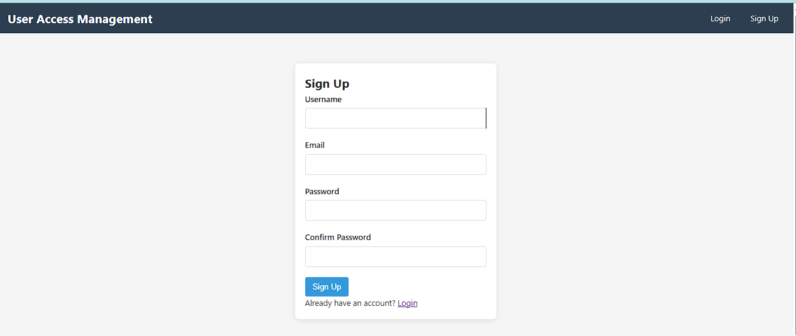

# Simplified User Access Management System

A full-stack application for managing user access to software systems. This project consists of separate frontend and backend applications that can be run independently.

## Features

- User registration and authentication
- Role-based access control (Employee, Manager, Admin)
- Software creation and management
- Access request submission and approval workflow

## Tech Stack

### Backend
- Node.js with Express
- MySQL with mysql2
- JWT for authentication

### Frontend
- React.js
- React Router for navigation
- Axios for API requests

## Project Structure

\`\`\`
user-access-management/
├── backend/           # Node.js + Express backend
├── frontend/          # React.js frontend
\`\`\`

## Setup Instructions

### Database Setup

1. Create a MySQL database:
   \`\`\`sql
   CREATE DATABASE user_access_management;
   \`\`\`

### Backend Setup

1. Navigate to the backend directory:
   \`\`\`
   cd backend
   \`\`\`

2. Install dependencies:
   \`\`\`
   npm install
   \`\`\`

3. Update the `.env` file with your MySQL credentials:
   \`\`\`
   PORT=5000
   DB_HOST=localhost
   DB_USERNAME=root
   DB_PASSWORD=your_password
   DB_NAME=user_access_management
   JWT_SECRET=your_secret_key
   \`\`\`

4. Start the development server:
   \`\`\`
   npm run dev
   \`\`\`

### Frontend Setup

1. Navigate to the frontend directory:
   \`\`\`
   cd frontend
   \`\`\`

2. Install dependencies:
   \`\`\`
   npm install
   \`\`\`

3. Start the development server:
   \`\`\`
   npm start
   \`\`\`

## API Endpoints

### Authentication
- `POST /api/auth/signup` - Register a new user
- `POST /api/auth/login` - Login and get JWT token

### Software Management
- `POST /api/software` - Create new software (Admin only)
- `GET /api/software` - Get all software
- `GET /api/software/:id` - Get software by ID

### Access Requests
- `POST /api/requests` - Create a new access request (Employee only)
- `GET /api/requests/pending` - Get all pending requests (Manager/Admin only)
- `PATCH /api/requests/:id` - Update request status (Manager/Admin only)
- `GET /api/requests/user` - Get current user's requests

## User Roles

1. **Employee**
   - Can register and login
   - Can request access to software
   - Can view their own access requests

2. **Manager**
   - Can view and approve/reject access requests
   - Can view all software

3. **Admin**
   - Can create new software
   - Can view and approve/reject access requests
   - Has full access to the system

## Testing the Application

1. Register a new user (default role is Employee)
2. To create an Admin user, manually update the role in the database:
   \`\`\`sql
   UPDATE users SET role = 'Admin' WHERE username = 'your_admin_username';
   \`\`\`
3. To create a Manager user:
   \`\`\`sql
   UPDATE users SET role = 'Manager' WHERE username = 'your_manager_username';
   \`\`\`

